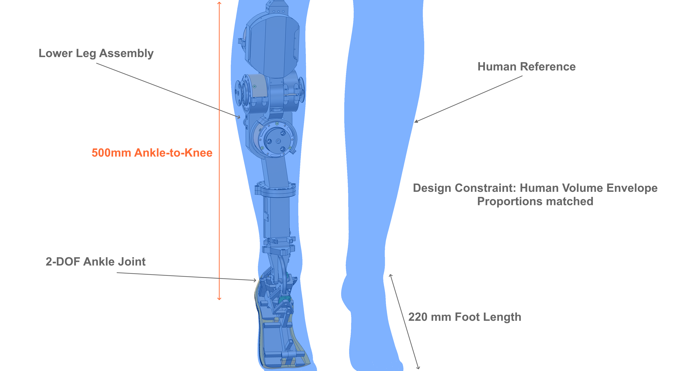
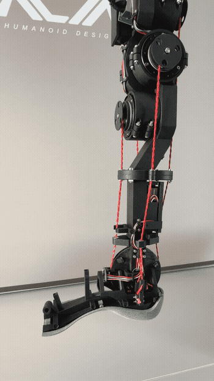
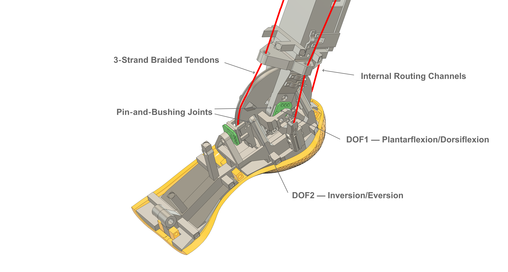

<p align="center">
  <picture>
    <source media="(prefers-color-scheme: dark)" srcset="docs/media/alia-banner-dark.png">
    
  </picture>
</p>

# Alia Humanoid

**Building humanoid mechanics inside real human proportions.**

<table>
<tr>
<td width="70%">

</td>
<td width="30%">

</td>
</tr>
<tr>
<td align="center"><i>Lower leg assembly — human scale comparison</i></td>
<td align="center"><i>Right ankle prototype — 2-DOF motion test</i></td>
</tr>
</table>

<p align="center">
  <a href="https://youtu.be/4jU5Na2z-s8">
    
  </a>
  <br />
  <i>Knee joint overlay — Joint Design Log #002</i>
</p>

---

## What We're Building

A humanoid robot designed from the ground up to fit within real human dimensions and proportions. 

Most humanoid projects scale UP for easier engineering — more space for motors, looser tolerances, simpler thermal management. We do the opposite: **building inside human constraints** forces radical design efficiency that replicates the elegance and efficiency of the human body and movement.

The result? A robot that can fit human environments, wear human clothing, and interact at human scale — using tendon-driven actuation, custom motor placement, and tight mechanical integration.

**Current Phase 0 Focus:** Lower leg assembly (knee + ankle + foot) with tendon-driven actuation.

### Latest Updates
- 2026-01-26: Joint Design Log #002 (Knee) published — [YouTube](https://youtu.be/4jU5Na2z-s8) · [X thread](https://x.com/AliaHumanoid/status/2015812906101657848)
- 2025-11-13: Joint Design Log #001 (Ankle) published — [YouTube](https://youtu.be/1Z9GlTnYEFs)
- 2025-10-31: Phase 0 public release — [PUBLIC_UPDATES.md](PUBLIC_UPDATES.md)

### Key Features

- 🦶 **2-DOF Ankle Joint**  
  Plantarflexion/dorsiflexion (-50° to +25°) + inversion/eversion (±25°)

- 🧵 **Tendon-Driven Actuation**  
  4 motors per joint with antagonistic control, counter-rotating for momentum cancellation

- 📏 **Human-Scaled Design**  
  Designed inside real human leg envelope — not scaled up

- ⚙️ **Real Hardware Iteration**  
  PA12 nylon structure (multi jet fusion), pin-and-bushing joints, UHMWPE tendons

- 📂 **Progressive Open Source**  
  Phased licensing roadmap: STL → STEP → CAD source

---

## Gallery

<table>
<tr>
<td width="50%">

<p align="center"><i>Physical prototype assembly (Phase 0)</i></p>
</td>
<td width="50%">

<p align="center"><i>Ankle cutaway showing tendon routing</i></p>
</td>
</tr>
</table>

---

## Current Status (Phase 0 — March 2026)

| Component | Status | License | Notes |
|-----------|--------|---------|-------|
| **Software** | ✅ Public | MIT | Python host + C++ firmware (RP2350 Pico 2) |
| **Hardware Docs** | ✅ Public | CC BY-NC-ND | Assembly guides, BOM, design specs |
| **STL Files** | ✅ Public | CC BY-NC-ND | 19 files: ankle, lower leg, common components |
| **Electronics** | ✅ Public | CC BY-NC-ND | RP2350 controller board (Gerber files + KiCad source) |
| **CAD Source** | 📅 Phase 2+ (TBD) | CC BY-SA | Full parametric Fusion 360 timeline |

See our [licensing roadmap](hardware/LICENSE.md) for details on the phased open-source transition.

---

## Quick Links

- 📺 **[YouTube Channel](https://www.youtube.com/@aliahumanoid)** — Design logs, demos, technical breakdowns
- 🐦 **[X/Twitter (@AliaHumanoid)](https://x.com/AliaHumanoid)** — Project updates, iteration logs
- 🌐 **[Website](https://aliahumanoid.com)** — Project overview and roadmap
- 📝 **[Public Updates](PUBLIC_UPDATES.md)** — Public milestone log and release notes
- 📖 **[Documentation](software/README.md)** — Software architecture, protocols, build guides
- 📐 **[Technical Specs](docs/specs/README.md)** — Joint specifications, motor specs, tendon specs

---

## What Works ✅ / What Doesn't ⚠️

We document **both successes and failures** transparently.

**Current validation snapshot: ankle and knee mechanics validated individually; integrated lower-body work still in progress**

### ✅ Validated (Phase 0)

- Ankle kinematics achieve target ROM (2 DOF within human envelope)
- Knee ROM and tendon-driven position control validated (0-100 degrees)
- Flat-braided 3-strand UHMWPE tendons (1mm diameter each) validated for load capacity and pulley compatibility
- Motor pulleys engineered for minimal footprint and closest distance to motor flange (reduces bearing wear)
- Tendon routing functional with minimal friction losses
- PA12 structure passes current static/load validation
- Peak torque matches biomechanics requirements
- Auto joint mapping with linear equations
- Simultaneous control of both DOF (coupled plantarflexion/dorsiflexion + inversion/eversion)
- Waypoint streaming at 50-100 Hz with buffer/interpolation (documented in Joint Design Log #002)

### ⚠️ Still Iterating

- Walking gait as an integrated lower-body system remains in progress
- Intelligent adaptive joint mapping and calibration adjustment in progress
- Real-time trajectory control refinement ongoing
- Multi-joint coordination (knee + ankle + foot) in progress


---

## Project Roadmap

### Phase 0 (Current) — Prove the Concept
- **Focus:** Lower leg (knee + ankle + foot) validation
- **Release:** Software (MIT), Hardware docs (CC BY-NC-ND)
- **Timeline:** In progress

### Phase 1 — Expand Hardware
- **Focus:** Full leg (hip, knee, ankle), upper body planning
- **Release:** STL → STEP files (CC BY-NC-SA)
- **Timeline:** Planned

### Phase 2 — Full Collaboration
- **Focus:** Complete humanoid system integration
- **Release:** CAD source files (CC BY-SA), governance formalized
- **Timeline:** TBD

### Phase 3 — Open-Core Model
- **Focus:** Distinguish core (fully open) from premium components
- **Release:** Transparent separation, commercial options if needed
- **Timeline:** TBD

---

## Follow Progress

This repository documents Phase 0 validation work in public. Small software/docs improvements and evidence-based feedback are welcome. See [CONTRIBUTING.md](CONTRIBUTING.md) for the current collaboration boundary.

**Ground Rules:**
- All commits require DCO sign-off: `git commit -s`
- Use English for code/comments/issues
- Follow conventional commit format (`feat:`, `fix:`, `docs:`, etc.)

**Current Accepted PR Scope:**
- 🐛 Bug reports and fixes
- 📖 Documentation improvements (clarity, examples, translations)
- 🧪 Testing and validation reports (especially hardware replication)
- 💡 Feature proposals (via issues first)

**Not Yet Open As PR Surface:**
- Hardware geometry changes to STL/CAD assets
- Canonical hardware design modifications while the public hardware release remains STL-only

For hardware design ideas, replication findings, and geometry feedback, open an issue first with evidence, measurements, or photos.

---

## References & Acknowledgments

### Control Architecture

The cascade control structure implemented for antagonistic tendon-driven actuation is inspired by the approach described in:

> **Lukić B., Jovanović K., Šekara T. B. (2019).**  
> *Cascade Control of Antagonistic VSA — An Engineering Control Approach to a Bioinspired Robot Actuator.*  
> Frontiers in Neurorobotics, Vol. 13, Article 69.  
> DOI: [10.3389/fnbot.2019.00069](https://doi.org/10.3389/fnbot.2019.00069)

The original paper presents a double-loop cascade architecture for simultaneous position and stiffness control of an antagonistic Variable Stiffness Actuator (VSA). 

In Alia's implementation, this concept has been extended and generalized to a multi-DOF humanoid control system, featuring:
- Coordinated cascade loops for multiple joints
- Per-DOF tuning of PID gains (inner loop: motor position, outer loop: joint position)
- Dynamic modulation of cascade influence and stiffness reference
- Synchronized trajectory generation for agonist–antagonist motor pairs

This implementation is an independent engineering development released under the MIT License.

---

## License

- **Software:** [MIT License](LICENSE)
- **Hardware:** See [hardware/LICENSE.md](hardware/LICENSE.md) for phased licensing roadmap

By contributing code, you license it under MIT. Hardware design feedback is welcome now; canonical hardware geometry changes will open later as the hardware release surface expands.

---

## Developer Certificate of Origin (DCO)

All commits must include a `Signed-off-by` line to certify you have the right to contribute:

```bash
git commit -s -m "feat: add ankle calibration script"
```

This asserts compliance with the [Developer Certificate of Origin](https://developercertificate.org/).

---

## Contact

- **General:** info@aliahumanoid.com
- **Issues/PRs:** Use GitHub issues and pull requests
- **Social:** [@AliaHumanoid](https://x.com/AliaHumanoid) on X/Twitter

---

**Project Status:** Phase 0 active development | Last updated: March 2026

---
